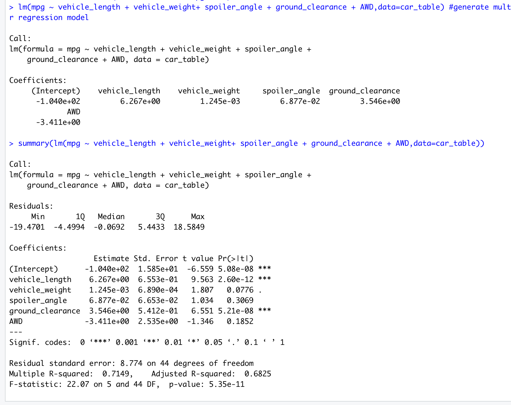

# MechaCar_Statistical_Analysis-

## Linear Regression to Predict MPG

Based on the results of the linear regression analysis using all six variables, the spoiler_angle,  AWD and vehicle weight impact the MPG. Vehicle length and ground clearance are statistically unlikely to affect the MPG.

The slope of the linear model is not considered to be zero. If the slope of the line was zero, the line would run flat along the horizontal axis.

The multiple R-squared value is 0.7149 which means approximately 71.5% of the variability of MPG is explained using the linear model. The p-value is 5.35e-11 which is smaller than the assumed significance level of 0.05%.

## Summary Statistics Suspension Coils

## T-Tests on Suspension Coils

## Study Design: MechaCar vs Competition

